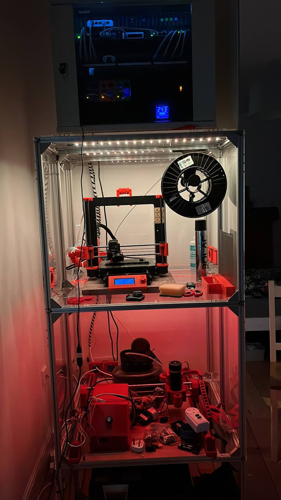
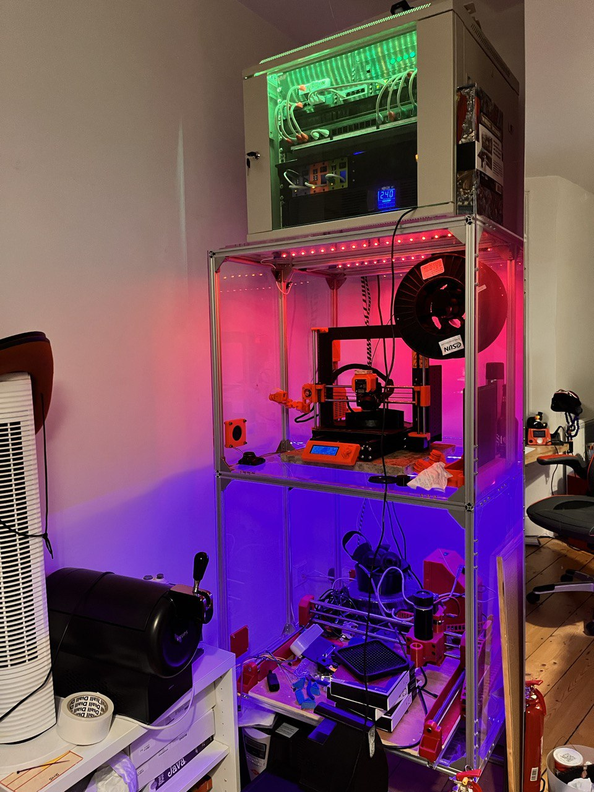

# LED Strip Controller Manifest

<!-- markdown-link-check-disable -->

[](https://www.gnu.org/licenses/gpl-3.0) [](https://github.com/ScottGibb/LED-Strip-Controller-Manifest/actions/workflows/Mega%20Linter.yaml) [](https://github.com/ScottGibb/LED-Strip-Controller-Manifest/actions/workflows/Repo%20Testing.yaml)

<!-- markdown-link-check-enable -->


## Summary

This project is a full stack project that revolved around controlling LED RGB light strips using a variety of different software applications. In this project, we use a variety of different systems such as STM32, ESP8266 and Raspberry Pi. The design of the system is described in the [Architecture](#architecture) section. The project is split into three main parts:

- [Firmware](https://github.com/ScottGibb/LED-Strip-Controller-Firmware) Is written in C++ and is used to control the hardware platform outlined in the hardware repositories. The firmware is developed using the Arduino ecosystem. It is designed as a highly modularized system and as such can run on a variety of different platforms.
  [Hardware](https://github.com/ScottGibb/LED-Strip-Controller-Hardware) To control the LED strips we need a way to interface with them. This is done using a variety of different hardware platforms. The hardware is designed using KiCad and the PCBS are designed to be used with the firmware listed above.
- [Software](https://github.com/ScottGibb/LED-Strip-Controller-Software) At the very top layer of the stack we have the software. In this repository, there is a variety of different application software and is designed to be used with the hardware and firmware listed above. Each of the different software applications solves a different issue such as Alexa integration, mobile application and simple command line applications. More on this is described in the repository itself.

As well as the three main parts listed above, there is also a daughter repository which is for integration with Octoprint:

- [Octoprint Integration](https://github.com/ScottGibb/LED-Strip-Controller-Octoprint) A simple repository containing integration scripts to be used with Octoprint and its plugins.

### Architecture

The architecture of the system is shown below, as described above the system is built with the idea of it being highly modularized, with that in mind a lot of the software applications run on a Raspberry Pi inside a docker container, for which docker-compose is being used as a way of orchestrating all the containers. The general design of the architecture is that user-based applications are written in high-level languages and connect to the hardware platform via USB or TCP depending on the microcontroller being used for the platform. As for casing, 3D printing is also used within this project along with Fusion 360 all of these designs are available on my [Thingiverse](https://www.thingiverse.com/scottgibb/designs) profile.


## Prototypes in Action

The prototype to be built from the Project is the lights that were used for my Server Rack and shelves. This is where the project started as I needed a lighting solution for my CNC and Prusa I3 Mk3s 3d printer. The result of this is shown below:




## Installation

As for installing the repo tool, please refer to the [repo tool documentation](https://gerrit.googlesource.com/git-repo/+/master/README.md#download-repo). For creating the project files and interacting with the source code, we use this repo tool as follows:

```bash
# Create a directory for the project
mkdir LEDStripController
cd LEDStripController
repo init -u "https://github.com/ScottGibb/LED-Strip-Controller-Manifest.git"
repo sync
```

Once this is done you should have four folders in your project directory, this will mirror the four GitHub repositories:

- `Firmware`
- `Hardware`
- `Software`
- `Manifest`

Each of these folders contains the source code and schematics for the respective part of the project.

## Useful Links

- [Repo Tool](https://gerrit.googlesource.com/git-repo)
- [Thingiverse Profile](https://www.thingiverse.com/scottgibb/designs)
